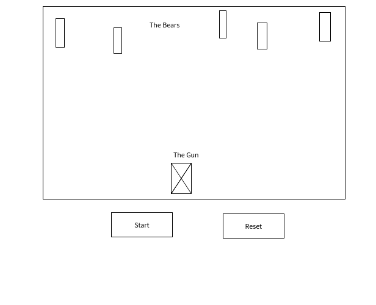

# Hunt The Bear

#### Live link
https://davidvelichko52.github.io/proj1SEI_30/

#### Description 
Hunt the bear is a game that was inspired by space invaders but but I wanted to add my own twist to it. In this game you as the hunter need to shoot as much bears as possible as the move down on you. The goal of the game is to try to stay alive by not letting the bears get to the bottom of the canvas.

# wireframe

### How to move
		
		-A = left
		-D = right
		-Space = Shoot

# Tech
    - The tech that I used:
        1. html
        2. css
        3.javascript 

# Stretch Goals 
    -Things to add if i have time 
        1. Speed up the movement of the bears
        2. Add sound to when shooting 
        
        
# External sources 
    1. Youtube
    2. W3Schools
    3. Mozilla 
